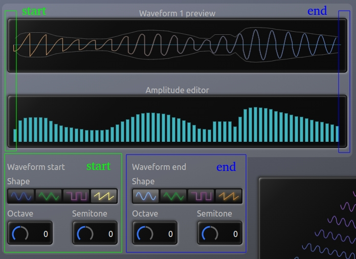

# Simple wavetable synthesizer made with Web Audio API and React
Dependencies:
- [Typescript](https://www.typescriptlang.org/) - main language
- [React](https://react.dev/) - UI library
- [Redux Toolkit](https://redux-toolkit.js.org/) - store library
- [tslog](https://www.npmjs.com/package/tslog) - logging library for TypeScript and JavaScript
- [Web Audio API](https://developer.mozilla.org/en-US/docs/Web/API/Web_Audio_API) - browser built-in audio system

[Project hosted on Netlify](https://react-wave-table-synth.netlify.app/)

# How it works
This synthesizer allows creating a wavetable by specifying 2 waveforms: the **start** and **end** waveforms. Then, all the other waveforms are created by interpolating between those 2 waveforms. The wavetable has 8 waveforms in total.
Everything is interpolated: the frequency, the amplitude and the shape.

# Modifying a waveform
For each of the 2 main waveforms, you can change the ends (the sides) of the waveform: the **start** and the **end**. Just like for the wavetable, the synthesizer interpolates the parameters from the **start** to the **end** of the waveform.
For a single waveform, the frequency and the shape are interpolated and the amplitude is drawn with discrete bars, in the Amplitude editor.

**PS:** please use only mouse **scroll wheel** to modify the numeric parameters:

**Notice!**
The application was made as best as possible, with log messages almost everywhere, except the sound generating functions. The logging library used seems to not allow global logging settings, so the loggs where left turned on.
If you see performance issues while drawing the amplitude bars (in the Amplitude editor), then please **close the browser console**, so the logs won't show up.
